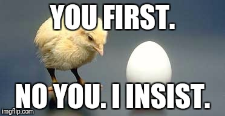

```{r setup, include=FALSE}
options(htmltools.dir.version = FALSE)
```

```{css, echo=FALSE}
pre {
  white-space: pre-wrap;
}
```

# Which came first, the chicken or the egg?

.center[]
---

# Once upon a time...

.pull-left[
January 2017


]

.pull-right[
Petr Šimecek @simecek


]

--

Let's do something fun together! 

--

## Learn Python!

---
## @python_tip
.center[]
---
# How it started...

.pull-left[
First tweet in February 2017


August 2017


]

.pull-right[


June 2019: 10k followers 


]

---

# How it is going...

```{r fig.width=9,fig.height=7, echo=FALSE}
library(readxl)
library(ggplot2)
df = read_excel('./data/follow.xlsx')
df$date <- as.Date(df$date)
ggplot(data=df, mapping = aes(x=date, y=sum)) +
  geom_line(color="#F8766D", size=2) +
  theme_bw() +
  theme(axis.text.x = element_text(angle = 90, hjust = 1, size = 13),
        axis.text.y = element_text(size = 16),
        axis.title = element_text(size = 20,face = "bold")
        ) +
  labs(x = "Date", y = "Sum of new followers") +
  scale_x_date(date_breaks = "4 months" , date_labels = "%b-%y")
```

---
## What makes a succesfull tweet?

.center[]
---
## What makes a succesfull tweet?
--
.pull-left[

]
.pull-right[

]
--

```{python}
mylist = ['first', 'second', 'third']
for i, item in enumerate(mylist):
    print(i, item)
    
```


---
# What happens when we reverse this string?

```{python include=FALSE}
s = 'Welcome in 🇬'
```

```{python include=FALSE}
t = '🇧'
s = s + t
```

```{python}
s
```

--

```{python eval=FALSE, echo=TRUE}
s[::-1]
```

--

```{python eval=TRUE, echo=FALSE}
s[::-1]
```

--

```{python}
list(reversed(s))
```

---
## Unpacking

```{python}
a, *b, c = [1, 2, 3, 4, 5]
a
b
c
```
--- 
--
```{python}
numbers = [1, 2, 3, 4, 5]
print(*numbers, sep='-')
```

---
## Zip "magic"

```{python}
a = ['a', 'b', 'c']
b = [1, 2, 3]

c = list(zip(a,b))
c
```

--

```{python}
dict(zip(a, b))
```

--

```{python}
list(zip(*c))
```

---
## a = a + b or a += b? Is it the same?

.pull-left[
```{python}
a = [1, 2, 3, 4]
b = a
a = a + [5, 6]
```


```{python}
a
b
```

]
--
.pull-right[

```{python}
a = [1, 2, 3, 4]
b = a
a += [5, 6]
```

{{content}}
]
--

```{python}
a
b
```

---
## a = a + b vs. a += b
.pull-left[
```{python}
a = [1, 2, 3, 4]
b = a
a = a + [5, 6]
```


```{python}
a
b
```

]

.pull-right[

```{python}
a = [1, 2, 3, 4]
b = a
a += [5, 6]
```


```{python}
a
b
```
]

Explanation: classes may implement the `op=` operators differently, which is the case of lists:
- `a = a + [5, 6]` generates a new list and sets `a`'s reference to that new list, `b` is unchanged
- `a += [5, 6]` is mapped to `extend` method, `a` is modified in place

---
## Generator expressions

```{python}
array = [1, 8, 15]
gen = (x for x in array if array.count(x) > 0)
array = [2, 8, 22]
```
--

```{python}
list(gen)

```

--

- `in` is evaluated at declaration time

- conditional clause is evaluated at runtime

---
## Generator expressions

```{python}
array_1 = [1,2,3,4]
gen_1 = (x for x in array_1)
array_1 = [1,2,3,4,5]

array_2 = [1,2,3,4]
gen_2 = (x for x in array_2)
array_2[:] = [1,2,3,4,5]
```

--
```{python}
list(gen_1)
list(gen_2)
```
--

- `array_1` is bound to the new object `[1,2,3,4,5]`, `gen_1` refers to the old object `[1,2,3,4]`
- `gen_2` and `array_2` have reference to the same object (which has been updated to `[1,2,3,4,5]`)

---
## Pathlib
```{python eval=TRUE, include=TRUE}
from pathlib import Path
p = Path('.')
p.resolve()  # get absolute path

```
--
```{python eval=TRUE, include=TRUE, tidy=TRUE, tidy.opts=list(width.cutoff=60)}
p = Path('..')
images = Path('..').glob('**/*gif')  # recursive globing
print(list(images)[:2])
```
--
```{python eval=FALSE, include=TRUE}
str(Path(__file__).resolve().parent) 
# Get the directory path of a python script from within itself
```
--
```{python eval=FALSE, include=TRUE}
Path('/my/new/directory').mkdir(parents=True, exist_ok=True) 
# Create a directory including all missing parents
# Don't raise an exception if the directory already exists
```


---
## Pandas: join the content of two string columns
```{python echo=FALSE}
import pandas as pd
df = pd.DataFrame.from_dict({'a':['Chip', 'Batman', 'Tom'], 'b':['Dale', 'Robin', 'Jerry']})
df
```
```{python}
df['c'] = df['a'].str.cat(df['b'], sep=' and ')
df
```

---
## Pandas: percentage of missing values

```{python}
df = pd.read_csv('./data/class-grades.csv')
df.head()
df.isnull().mean()*100
```


---
## Pandas: exploding list-like columns
```{python}
df = pd.DataFrame([{'var1': 'a,b,c', 'var2': 1},
                   {'var1': 'd,e,f', 'var2': 2}])
df              
df = df.assign(var1=df.var1.str.split(',')).explode('var1')
df
```
---
## Jupyter / IPython


    * In [13]: !ls
      2017august.jpg	june2019.png	mapa.png	yesno.jpeg
      baxter.jpeg	logo.jpeg	old.png

    * In [14]: a = !ls

      In [15]: a
      Out[15]: 
      ['2017august.jpg',
       'baxter.jpeg',
       'june2019.png',
       'logo.jpeg',
       'mapa.png',
       'old.png',
       'yesno.jpeg']

---
## Jupyter notebook + handcalcs

- render Python calculation code automatically in Latex


---
# Which came first, the chicken or the egg?

--


```{python eval=TRUE, tidy=FALSE}
x = ['\N{EGG}','\N{CHICKEN}']
sorted(x)
```

---

# Send us your tips!

- [http://bit.ly/pythontip](http://bit.ly/pythontip)

- Just mention [@python_tip](https://twitter.com/python_tip) if you want us to cite or RT you

--

.center[]

